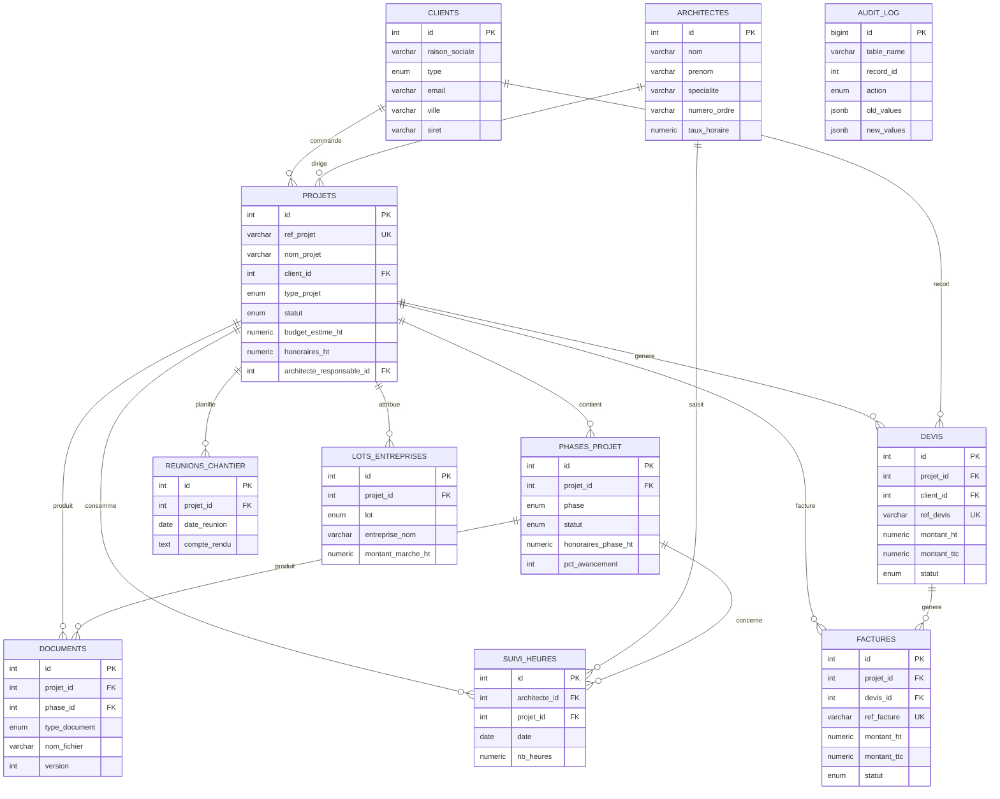

# Diagramme ERD — Cabinet d'Architecture

## Diagramme Mermaid

```mermaid
erDiagram
    CLIENTS ||--o{ PROJETS : "commande"
    ARCHITECTES ||--o{ PROJETS : "dirige"
    PROJETS ||--o{ PHASES_PROJET : "contient"
    PROJETS ||--o{ DOCUMENTS : "produit"
    PROJETS ||--o{ DEVIS : "genere"
    PROJETS ||--o{ FACTURES : "facture"
    PROJETS ||--o{ REUNIONS_CHANTIER : "planifie"
    PROJETS ||--o{ LOTS_ENTREPRISES : "attribue"
    PROJETS ||--o{ SUIVI_HEURES : "consomme"
    ARCHITECTES ||--o{ SUIVI_HEURES : "saisit"
    CLIENTS ||--o{ DEVIS : "recoit"
    DEVIS ||--o{ FACTURES : "genere"
    PHASES_PROJET ||--o{ DOCUMENTS : "produit"
    PHASES_PROJET ||--o{ SUIVI_HEURES : "concerne"

    CLIENTS {
        int id PK
        varchar raison_sociale
        enum type
        varchar email
        varchar ville
        varchar siret
    }

    ARCHITECTES {
        int id PK
        varchar nom
        varchar prenom
        varchar specialite
        varchar numero_ordre
        numeric taux_horaire
    }

    PROJETS {
        int id PK
        varchar ref_projet UK
        varchar nom_projet
        int client_id FK
        enum type_projet
        enum statut
        numeric budget_estime_ht
        numeric honoraires_ht
        int architecte_responsable_id FK
    }

    PHASES_PROJET {
        int id PK
        int projet_id FK
        enum phase
        enum statut
        numeric honoraires_phase_ht
        int pct_avancement
    }

    DOCUMENTS {
        int id PK
        int projet_id FK
        int phase_id FK
        enum type_document
        varchar nom_fichier
        int version
    }

    DEVIS {
        int id PK
        int projet_id FK
        int client_id FK
        varchar ref_devis UK
        numeric montant_ht
        numeric montant_ttc
        enum statut
    }

    FACTURES {
        int id PK
        int projet_id FK
        int devis_id FK
        varchar ref_facture UK
        numeric montant_ht
        numeric montant_ttc
        enum statut
    }

    REUNIONS_CHANTIER {
        int id PK
        int projet_id FK
        date date_reunion
        text compte_rendu
    }

    LOTS_ENTREPRISES {
        int id PK
        int projet_id FK
        enum lot
        varchar entreprise_nom
        numeric montant_marche_ht
    }

    SUIVI_HEURES {
        int id PK
        int architecte_id FK
        int projet_id FK
        date date
        numeric nb_heures
    }

    AUDIT_LOG {
        bigint id PK
        varchar table_name
        int record_id
        enum action
        jsonb old_values
        jsonb new_values
    }
```
